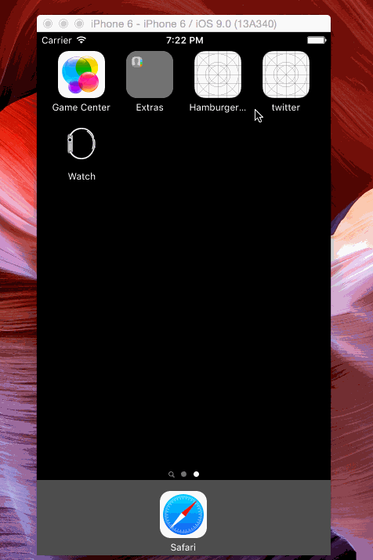

## Twitter Redux

Time spent: `17h`

### Features

#### Required

- :white_check_mark: Hamburger menu
   - :white_check_mark: Dragging anywhere in the view should reveal the menu.
   - :white_check_mark: The menu should include links to your profile, the home timeline, and the mentions view.
   - :white_check_mark: The menu can look similar to the LinkedIn menu below or feel free to take liberty with the UI.
- :white_check_mark: Profile page
   - :white_check_mark: Contains the user header view
   - :white_check_mark: Contains a section with the users basic stats: # tweets, # following, # followers
- :white_check_mark: Home Timeline
   - :white_check_mark: Tapping on a user image should bring up that user's profile page

#### Optional

- [ ] Profile Page
   - [ ] Optional: Implement the paging view for the user description.
   - [ ] Optional: As the paging view moves, increase the opacity of the background screen. See the actual Twitter app for this effect
   - [ ] Optional: Pulling down the profile page should blur and resize the header image.
- [ ] Optional: Account switching
   - [ ] Long press on tab bar to bring up Account view with animation
   - [ ] Tap account to switch to
   - [ ] Include a plus button to Add an Account
   - [ ] Swipe to delete an account

### Walkthrough

